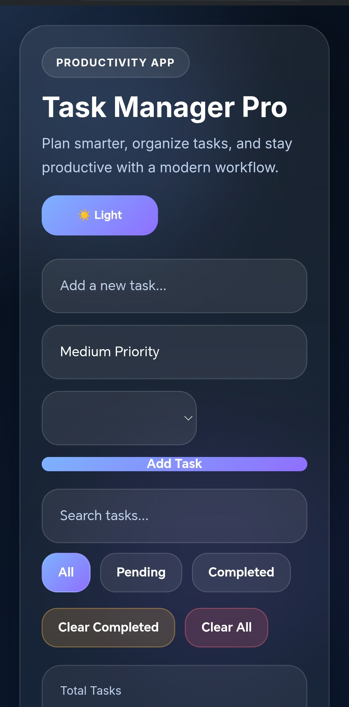

# ✅ Task Manager Pro

Modern task management application built using **HTML, CSS, and JavaScript**.

This project helps users organize their daily tasks, manage priorities, and stay productive with a clean and responsive interface.

---

## 🌐 Live Demo

https://semo1682.github.io/task-manager-pro/

---

## ✨ Features

- Add new tasks
- Edit tasks
- Delete tasks
- Mark tasks as completed
- Search tasks instantly
- Filter tasks (All / Pending / Completed)
- Task priority system
- Drag & Drop task sorting
- Clear completed tasks
- Clear all tasks
- Save tasks using LocalStorage
- Responsive modern UI

---

## 🛠 Technologies

- HTML5
- CSS3
- JavaScript
- LocalStorage

---

## 📸 Preview

---

## 👨‍💻 Author

**Eslam Mesalam**  
Front-End Developer
